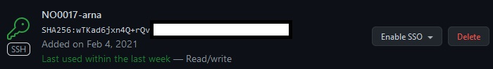
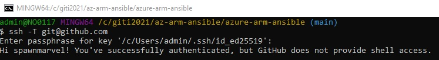

# azure-arm-bash
Stuff about Azure, ARM Templates and Bash

## Prerequisite 1 Git BASH, SSH and keys

BASH connect to a Github repository and clone it.
Make a folder and cd into it:
mkdir folder
cd folder

Test connection to Github:
```sh
$ ssh -T git@github.com
$ git@github.com: Permission denied (publickey).
```

Connecting to GitHub with SSH
[connecting-to-github-with-ssh](https://docs.github.com/en/github/authenticating-to-github/connecting-to-github-with-ssh)

Checking for existing SSH keys
```sh
$ ls -al ~/.ssh
```
Check the directory listing to see if you already have a public SSH key. By default, the filenames of the public keys are one of the following:
* id_rsa.pub
* id_ecdsa.pub
* id_ed25519.pub

If you don't have an existing public and private key pair, or don't wish to use any that are available to connect to GitHub, then generate a new SSH key.

[generating-a-new-ssh-key](https://docs.github.com/en/github/authenticating-to-github/generating-a-new-ssh-key-and-adding-it-to-the-ssh-agent#adding-your-ssh-key-to-the-ssh-agent)

Generating a new SSH key
Paste the text below, substituting in your GitHub email address.

```sh
$ ssh-keygen -t ed25519 -C "your_email@example.com"
Generating public/private ed25519 key pair.
Enter file in which to save the key (/c/Users/admin/.ssh/id_ed25519):
Enter passphrase (empty for no passphrase):
Enter same passphrase again:
Your identification has been saved in /c/Users/admin/.ssh/id_ed25519
Your public key has been saved in /c/Users/admin/.ssh/id_ed25519.pub
The key fingerprint is:
```

Adding a new SSH key to your GitHub account

[adding-a-new-ssh-key-to-your-github-account](https://docs.github.com/en/github/authenticating-to-github/adding-a-new-ssh-key-to-your-github-account)

Copy the SSH public key content to your clipboard from:
* id_ed25519.pub

If you are on Linux, access the SSH folder like this
* cd ~/.ssh
* cat id_ed25519.pub

Go to Github->Profile->Settings->SSH and GPG keys
* SSH Key add new
* Title = a name
* Key = ctrl-v (the content in id_ed25519.pub it is one line with @ also)

[

Test connection to Github again and enter passphrase:
```sh
$ ssh -T git@github.com
Enter passphrase for key '/c/Users/admin/.ssh/id_ed25519':
Hi spawnmarvel! You've successfully authenticated, but GitHub does not provide shell access.
```

Now clone the repos and enter the passphrase:
Choose SSH from Github (not HTTPS or the other)

```sh
$ git clone git@github.com:spawnmarvel/azure-arm-ansible.git
Cloning into 'azure-arm-ansible'...
Enter passphrase for key '/c/Users/admin/.ssh/id_ed25519':
remote: Enumerating objects: 3, done.
remote: Counting objects: 100% (3/3), done.
remote: Compressing objects: 100% (2/2), done.
remote: Total 3 (delta 0), reused 0 (delta 0), pack-reused 0
Receiving objects: 100% (3/3), done.
```

Cd into the folder
```sh
$ cd folder
```

We are autmaticaly in the main branch (git switch <existing_branch>)

Do some changes..
```sh
$ git add .
$ git commit -m "a commit"
$ git push
Enter passphrase for key '/c/Users/admin/.ssh/id_ed25519':

```
[

## Prerequisite 1  Az cli
Download azure-cli for win

[Azure CLI on Windows](https://docs.microsoft.com/en-us/cli/azure/install-azure-cli-windows?tabs=azure-cli)

#### Note about AZ cli version
[Azure CLI on Windows --parameters @file.jso.](https://github.com/Azure/azure-cli/issues/3729)

#### Note about what-if
[The what-if operation can't resolve the reference function](https://docs.microsoft.com/en-us/azure/azure-resource-manager/templates/template-deploy-what-if?tabs=azure-powershell)

When it is installed,export the configuration, test or prod, login to Azure

```sh
$ export PIPELINE=test
$ az login
# if that does not work, go to Portal.azure.com > Azure Active Directory > Properties and you will see the tenant id, cp it
$ az login --tenant the-tenant-id-we-copied
# The default web browser has been opened at https://login.microsoftonline.com/the-tenant-id-we-copied
[
  {
    "cloudName": "AzureCloud",
```
# Azure 1

* Make a template in the portal and use an existing virtual network, do not create the vm, just review and download template and parameter
* Set adminUsername and adminPassword to null
* adminUsername and adminPassword will be set on deploy
* Add a parameter in parameters file masterPrefixName, add the same parameters in template. 
* In the Template use the prefix for below paramters, and remove them from the paramters file, since they are no longer needed
* Added one datadisk in the template file, the  "type": "Microsoft.Compute/disks", is an isolated object, the copy object belongs to "type": "Microsoft.Compute/virtualMachines",

## Parameters file
```json
"masterPrefixName": {
            "value": null
        },

```
## Template file
```json
"masterPrefixName": {
            "type": "string",
            "minLength": 3,
            "maxLength": 5
        },

 "location": {
            "type":"string",
            "defaultValue": "[resourceGroup().location]"
        },
        "networkInterfaceName": {
            "type": "string",
            "defaultValue": "[concat(parameters('masterPrefixName'), '-test-vm-nic')]"
        },
        "networkSecurityGroupName": {
            "type": "string",
            "defaultValue": "[concat(parameters('masterPrefixName'), '-test-vm-nsg')]"
        },

"publicIpAddressName": {
            "type": "string",
            "defaultValue": "[concat(parameters('masterPrefixName'), '-test-vm-ip')]"
        },   
"virtualMachineName": {
            "type": "string",
            "defaultValue": "[concat(parameters('masterPrefixName'), '-test-vm')]"
        },
        "virtualMachineComputerName": {
            "type": "string",
            "defaultValue": "[concat(parameters('masterPrefixName'), '-test-vm')]"
        },
        "virtualMachineRG": {
            "type": "string",
            "defaultValue": "[concat(parameters('masterPrefixName'), '-test-vm-rg')]"
        },         


         "dataDisks": {
            "type": "Array",
            "defaultValue": [
                {
                    "lun": 0,
                    "createOption": "attach",
                    "caching": "None",
                    "writeAcceleratorEnabled": false,
                    "id": null,
                    "name": "[concat(parameters('masterPrefixName'), '-datadisk-0')]",
                    "storageAccountType": null,
                    "diskSizeGB": null,
                    "diskEncryptionSet": null
                }
            ]
        },
        "dataDiskResources": {
            "type": "Array",
            "defaultValue": [
                {
                    "name": "[concat(parameters('masterPrefixName'), '-datadisk-0')]",
                    "sku": "Premium_LRS",
                    "properties": {
                        "diskSizeGB": 16,
                        "creationData": {
                            "createOption": "empty"
                        }
                    }
                }
            ]
        },

         {
            "name": "[parameters('dataDiskResources')[copyIndex()].name]",
            "type": "Microsoft.Compute/disks",
            "apiVersion": "2020-09-30",
            "location": "[parameters('location')]",
            "properties": "[parameters('dataDiskResources')[copyIndex()].properties]",
            "sku": {
                "name": "[parameters('dataDiskResources')[copyIndex()].sku]"
            },
            "copy": {
                "name": "managedDiskResources",
                "count": "[length(parameters('dataDiskResources'))]"
            },
            "zones": [
                "[parameters('zone')]"
            ]
        },


        "copy": [
                        {
                            "name": "dataDisks",
                            "count": "[length(parameters('dataDisks'))]",
                            "input": {
                                "lun": "[parameters('dataDisks')[copyIndex('dataDisks')].lun]",
                                "createOption": "[parameters('dataDisks')[copyIndex('dataDisks')].createOption]",
                                "caching": "[parameters('dataDisks')[copyIndex('dataDisks')].caching]",
                                "diskSizeGB": "[parameters('dataDisks')[copyIndex('dataDisks')].diskSizeGB]",
                                "managedDisk": {
                                    "id": "[coalesce(parameters('dataDisks')[copyIndex('dataDisks')].id, if(equals(parameters('dataDisks')[copyIndex('dataDisks')].name, json('null')), json('null'), resourceId('Microsoft.Compute/disks', parameters('dataDisks')[copyIndex('dataDisks')].name)))]",
                                    "storageAccountType": "[parameters('dataDisks')[copyIndex('dataDisks')].storageAccountType]"
                                },
                                "writeAcceleratorEnabled": "[parameters('dataDisks')[copyIndex('dataDisks')].writeAcceleratorEnabled]"
                            }
                        }
                    ]
```
* This deployment needs an existing vnet, since we are creating and connecting the vm to the existing vnet for the simple-vm


